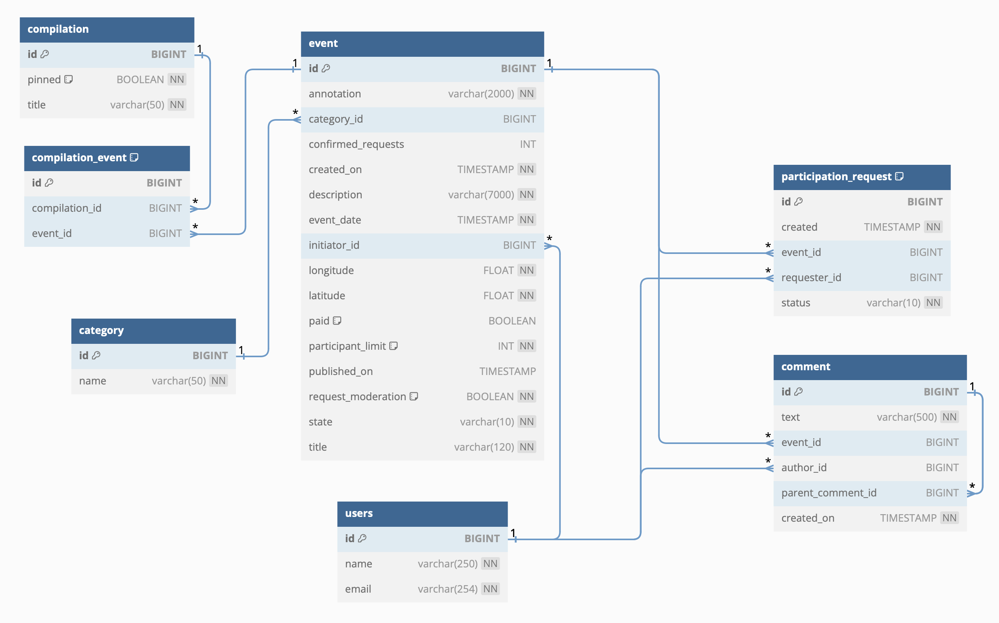
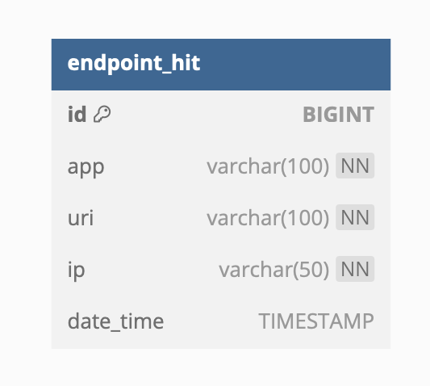

# JAVA-EXPLORE-WITH-ME

An API service for the application that allows users to share information about interesting events, comment on events and find a company to participate in them.

The project has a microservice architecture (maven, Docker). 4 microservices: [main](ewm-service), [additional](stats-service) and 2 databases. The second is used to store the number of views by event. The main service is divided into 3 abstract layers: public (unregistered users), private (registered) and admin (administration).

Technologies:
* Java 11
* Lombok
* Spring Boot
* Hibernate, JPA
* PostgreSQL
* Docker
* Maven

---
### SWAGGER

The project was implemented according to specification.

* [main service](ewm-main-service-spec.json)
* [stats service](ewm-stats-service-spec.json)

---
### MAIN SERVICE DATABASE STRUCTURE ER-DIAGRAM

---
### ADDITIONAL SERVICE DATABASE STRUCTURE ER-DIAGRAM

